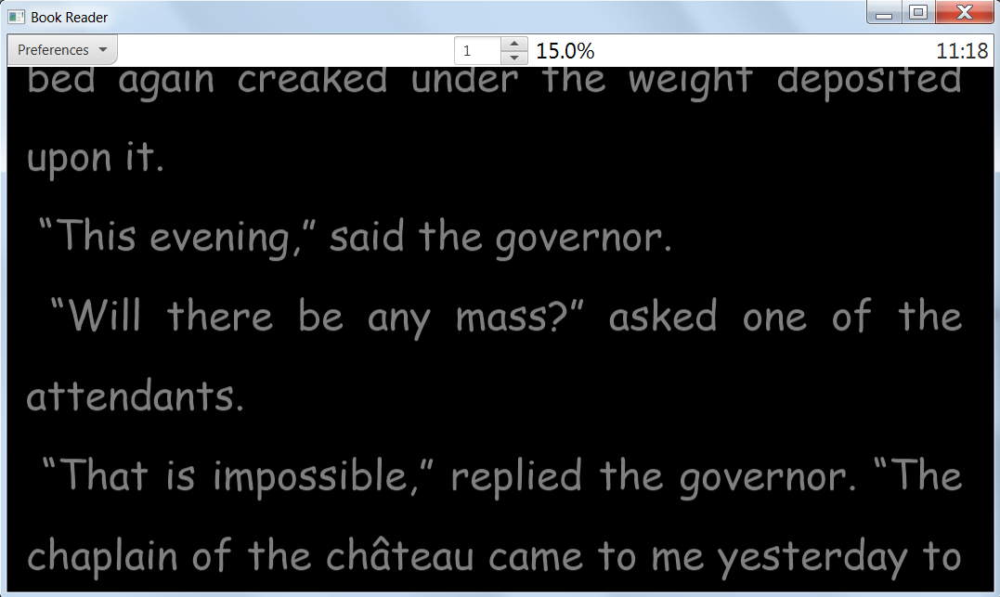
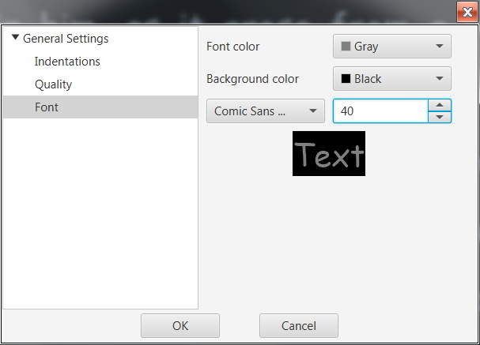

# BookJP Reader

This is a program to read books on PC.

### Why does this program exist?

There are several reasons I decided to create it. 
First and foremost I have studied Java for a while and the best way to study a new programming language is to write something in it.
The other reason is that I like reading books on my PC and I miss some features (e.g. smooth autoscrolling).

### The main features of BookJ Reader
* It is cross-platform (it is Java).
* It has the ability to smoothly scroll text.
* There is an autoscroll option with speed adjustments.
* It can read plain text (different encodings), fb2 and html files.
* It is portable - all settings are saved in the same directory as the program.

### What are current limitations
* The program is in development which means that it can posess bugs and lack some essential features.
* It doesn't support images in text files.

### Requirements
To use this program you need to have Java 8.
It uses JavaFX so you may need to install it as well (it isn't always preinstalled on some systems along with Java).

### How to start it
There are runnable jar files in the target directory.

### Screenshots
  
